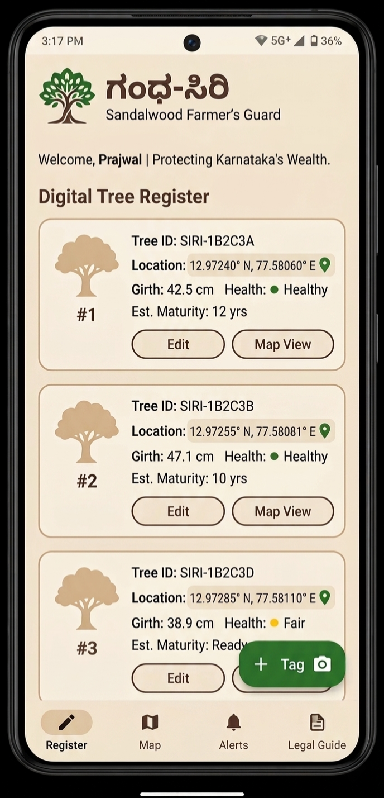

# Gandha-Siri (ಗಂಧ-ಸಿರಿ) 🌳

<p align="center">
  
</p>

**Android App Development using GenAI - Natural Resources**

Gandha-Siri is a digital guardian for Sandalwood farmers. It aims to revitalize the "Sandalwood State" status by removing the fear of theft and legal complexity.

## 📋 Problem Statement
Sandalwood is a high-value resource in Karnataka, but farmers often avoid growing it due to high theft risks and complex forest department regulations. Gandha-Siri digitizes tree management to provide security and legal transparency.

## 🌟 Key Features
* **Digital Tree Registry:** Tag trees with GPS precision using `FusedLocationProviderClient`.
* **Maturity Calculator:** AI-driven estimation of heartwood formation based on girth-to-age ratios.
* **Panic Button:** Instant simulated SMS/Notification system to alert neighbors of suspicious activity.
* **Sandalwood Palette:** A clean, minimalist UI designed with earth tones for rural usability.

## 🛠 Tech Stack
* **Language:** Kotlin
* **UI:** Jetpack Compose
* **Database:** Room DB (Offline-first for remote farms)
* **Architecture:** MVVM (Model-View-ViewModel)

## 📂 Project Structure
```text
app/src/main/java/com/gandhasiri/
[span_1](start_span)├── data/       # Room DB entities and local storage[span_1](end_span)
[span_2](start_span)├── domain/     # Business logic & Growth calculators[span_2](end_span)
├── security/   # Alert systems and mesh network logic
[span_3](start_span)└── ui/         # Jetpack Compose screens and themes[span_3](end_span)
